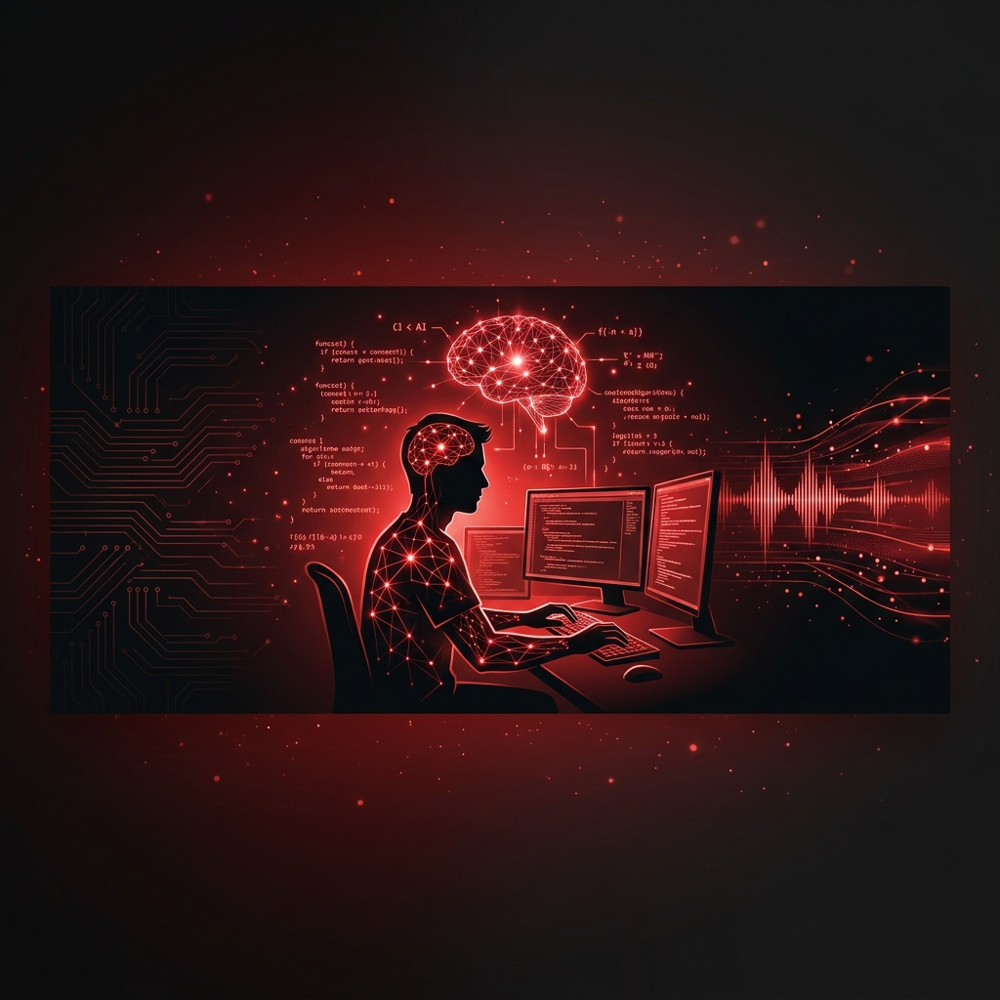
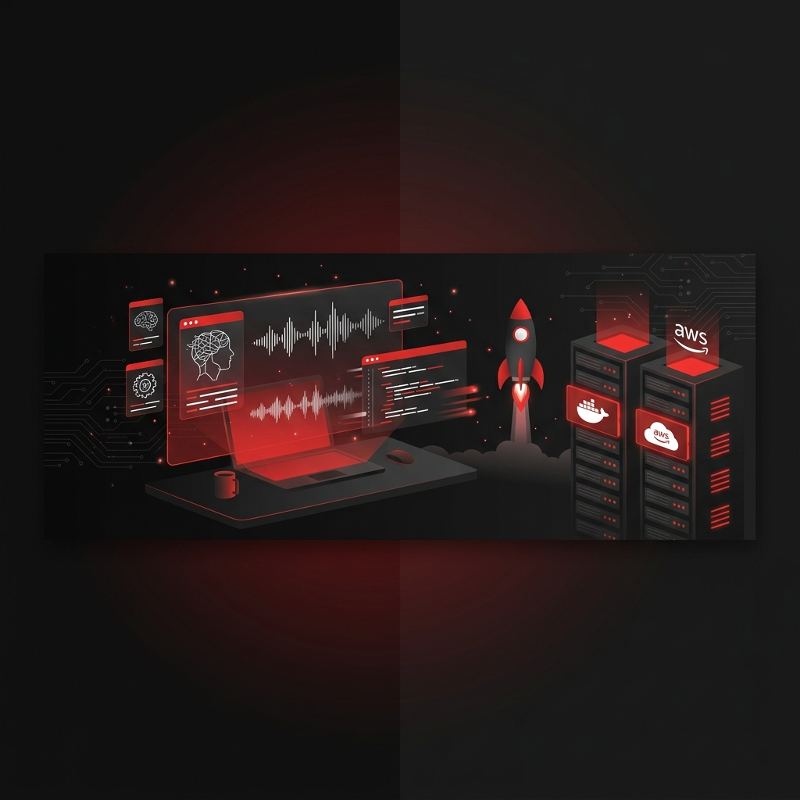
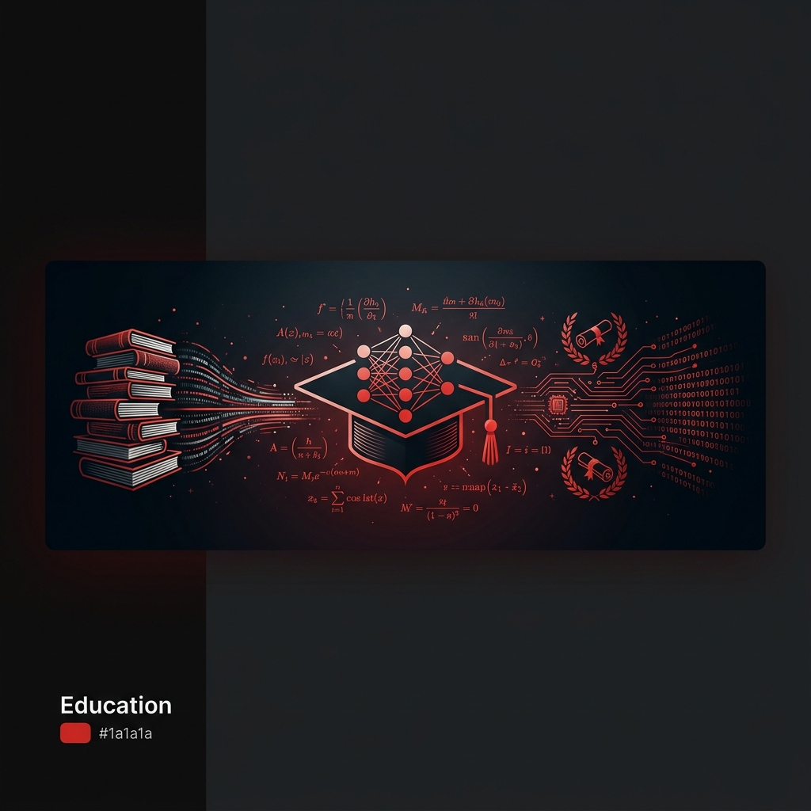

  

  
  
  
  

## ◈ About

  

> 🧠 AI Developer with a **BCA** and currently pursuing **M.Sc. in Artificial Intelligence**, with **7 months** of professional experience. Hands-on experience building real-world AI solutions across two major production projects — **ExamBro** and **SKAIS** — spanning LLM applications, RAG pipelines, and conversational AI voice agents.

&nbsp;&nbsp;&nbsp;&nbsp;📍 **Bhavnagar, Gujarat, India** &nbsp;·&nbsp; 🎓 **M.Sc. AI** @ MKBU

<table>
  <tr>
    <td width="50%">

| 🔴 Core Expertise |
|:---|
| ▸ **Generative AI & LLMs** — Prompt Engineering, OpenAI, Gemini, Claude, HuggingFace |
| ▸ **RAG & Vector Search** — FAISS, Pinecone, Embeddings, Chunking Strategies |
| ▸ **AI Agents** — LangChain, LangGraph, Google ADK, MCP, Multi-Agent Workflows |
| ▸ **OCR & Vision** — Mistral OCR, OpenCV, PyMuPDF, PyTorch |

   </td>
    <td width="50%">

| ⚡ Engineering Skills |
|:---|
| ▸ **Backend & APIs** — FastAPI, Django, RESTful Design |
| ▸ **Databases** — PostgreSQL, MongoDB, MySQL, Supabase |
| ▸ **Cloud & DevOps** — AWS, Docker, Git, GitHub |
| ▸ **AI Tools** — Cursor AI, Claude Code, Google Antigravity |

   </td>
  </tr>
</table>

## ◈ Tech Stack

  
  
  
  
  
  
  
  
  
  
  
  
  
  
  
  
  
  
  
  

## ◈ Projects

---

  

### 🔴 SKAIS — AI-Powered Restaurant Order Management System

> **Problem:** Restaurants relied on staff to answer every phone call for orders & reservations — missed calls during busy hours and ongoing staffing cost.

- ▸ Built a **voice AI agent** (Retell AI SDK) that answers the restaurant's phone line directly — sharing menu items, prices & availability, and taking full orders or reservations **without a human on the call**
- ▸ Connected the agent to a **RAG knowledge base** holding restaurant-specific details (location, hours, policies) so it answers general customer questions **accurately**
- ▸ Built **live price & prep-time calculation** into the call flow, plus **automatic SMS confirmation** sent to the customer right after an order or reservation
- ▸ Gave restaurant owners a **settings page** to adjust reservation rules & agent behavior without touching code, and built a companion **support chatbot** (LangChain) for the SaaS platform
- ▸ Handled **103+ live calls** in production at roughly **$1,000–$1,500/month** in software cost, versus **$2,000–$3,000/month** for a human phone operator

  
  
  

**Stack**: `Python` · `FastAPI` · `Retell AI SDK` · `Next.js` · `Supabase` · `Gemini AI` · `LangChain` · `Twilio SDK` · `Square POS`

---

  

### 🔴 ExamBro — Question Extraction & Exam Management System

> **Problem:** Teachers were manually typing every exam question, answer, and diagram into the student portal — slow and error-prone.

- ▸ Built an **OCR pipeline** (Mistral OCR) that pulls questions, answers, solutions, diagrams & options straight out of **any PDF** a teacher uploads — **removing manual entry entirely**
- ▸ Fixed a recurring bug where **diagram positions were shifting** out of alignment with their questions during extraction
- ▸ Used **Gemini AI via LangChain** to convert raw OCR output into **structured JSON** and auto-fill missing answers where possible
- ▸ Deployed the pipeline in **Docker containers** and added **multilingual translation** support plus **bulk question management** in the admin dashboard

**Stack**: `Python` · `Django` · `FastAPI` · `PyMuPDF` · `Mistral OCR` · `OpenCV` · `Gemini AI` · `Supabase`

## ◈ Experience

  

<table>
  <tr>
    <td width="100%">

### 🔴 AI Developer &nbsp;—&nbsp; Cloudus Infotech, Surat, Gujarat

`Dec 2025` ━━━━━━━━━━━━━━━━━━━━ `Jun 2026` &nbsp; **· 7 Months**

   </td>
  </tr>
</table>

- ▸ Built a **voice AI agent** using the Retell AI SDK that answers **live customer calls** for a restaurant ordering platform — sharing menu items, prices & availability, and taking full orders or reservations **without a staff member picking up the phone**
- ▸ Fixed an early **hallucination problem** where the agent gave wrong or confusing answers mid-call by **rewriting and fine-tuning prompts** and tightening guardrails until responses held up reliably across real calls
- ▸ Connected the agent to a **RAG knowledge base** so it could pull restaurant-specific answers — location, hours, policies — from **uploaded documents** instead of hardcoded scripts
- ▸ Built the backend (**FastAPI, Supabase**) that logs full **call transcripts** and customer details after every call, and used the **Twilio SDK** to automatically send SMS confirmations
- ▸ Built an **OCR pipeline** (Django, FastAPI, PyMuPDF, Mistral OCR, Gemini AI) for a separate exam-prep platform that pulls questions, answers & diagrams out of **any PDF format** — and deployed it in **Docker**
- ▸ **Deployed and hosted** the production backend on **AWS**, resolving environment and configuration issues along the way
- ▸ Used **Git/GitHub** throughout and worked across the **full lifecycle** — requirement analysis, system design, implementation, testing & deployment — for both platforms

## ◈ Education

  

<table>
  <tr>
    <td align="center" width="50%">
       
      
        
      <h3>🎓 M.Sc. Artificial Intelligence</h3>
      
<strong>Maharaja Krishnakumarsinhji Bhavnagar University</strong>

      
<em>Specializing in ML, Deep Learning & NLP</em>

       
    </td>
    <td align="center" width="50%">
       
      
        
      <h3>📘 Bachelor of Computer Applications</h3>
      
<strong>Maharaja Krishnakumarsinhji Bhavnagar University</strong>

      
<em>Foundation in CS, Programming & Data Structures</em>

       
    </td>
  </tr>
</table>

## ◈ Connect

  
  
  

  

