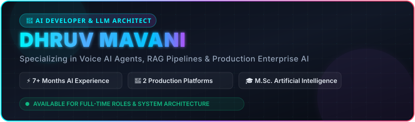
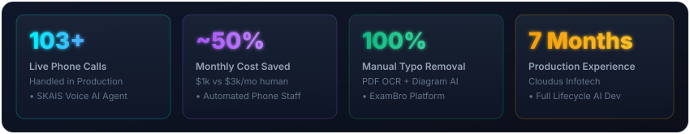
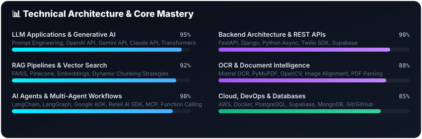
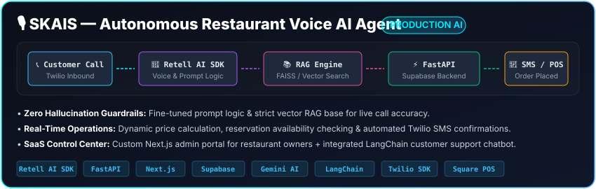
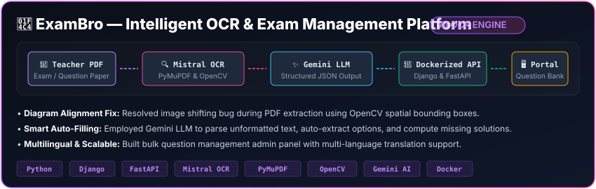

<!-- Hero Banner Graphic -->

  

<!-- Interactive Quick Links & Social Badges -->

  

<!-- Profile Summary Callout -->
> 🚀 **AI Developer with 7+ months of production experience** engineering real-world LLM systems, autonomous voice AI agents, multi-agent RAG pipelines, and document intelligence OCR engines. Currently pursuing **M.Sc. in Artificial Intelligence**.

 

---

## ⚡ Executive Impact &amp; Key Resume Metrics

  

 

---

## 🛠️ Tech Stack &amp; AI Ecosystem

| Domain | Technologies &amp; Frameworks |
| :--- | :--- |
| **🤖 Generative AI &amp; LLMs** |      |
| **🧠 Agents &amp; RAG Architecture** |       |
| **🌐 Backend &amp; Databases** |      |
| **🔍 OCR &amp; Vision** |     |
| **☁️ Cloud &amp; AI IDEs** |      |

 

---

## 📊 Technical Architecture Mastery

  

 

---

## 🚀 Key Production Projects

### 🎙️ 1. SKAIS — Autonomous Restaurant Voice AI Agent Platform
> **Live Production System:** Replaced traditional human operators with a conversational voice AI capable of managing live customer calls, dynamic pricing, and restaurant table reservations.

  

- 📞 **Voice Interaction:** Leveraged Retell AI SDK to answer inbound calls, communicate menu details, handle availability, and process full orders.
- 🎯 **Hallucination Prevention:** Fine-tuned system prompts and implemented RAG guardrails for zero-error responses.
- 🔗 **Integrations:** Connected FastAPI &amp; Supabase backend to Twilio for instant SMS confirmations and Square POS for order entry.
- 💰 **ROI:** Processed 103+ live calls with operating costs at $1,000–$1,500/month vs $2,000–$3,000/month for human operators.

---

### 📄 2. ExamBro — Intelligent OCR &amp; Exam Management System
> **Production Document Pipeline:** Replaced manual typing of exam questions and diagrams with an end-to-end multi-modal OCR pipeline.

  

- 🔍 **Automated Extraction:** Built a Mistral OCR &amp; PyMuPDF pipeline extracting questions, answers, solutions, and mathematical diagrams directly from uploaded PDFs.
- 📐 **Diagram Alignment Fix:** Solved a critical spatial shifting bug using OpenCV bounding-box coordinate tracking.
- 🧠 **LLM Structuring:** Integrated Google Gemini AI via LangChain to convert raw OCR output into structured JSON and compute missing solutions.
- 🐳 **Deployment:** Containerized backend using Docker with Django/FastAPI and added multi-language support in the admin portal.

 

---

## 💼 Work Experience

### **AI Developer** — *Cloudus Infotech* `[Dec 2025 – Jun 2026]` *(7 Months)*
*Surat, Gujarat, India*

- **Voice AI Agent Development:** Designed and deployed a voice AI agent using **Retell AI SDK** that handled live phone calls for restaurant ordering and table reservations.
- **RAG Architecture:** Connected conversational AI to vector knowledge bases (FAISS) containing restaurant policies, schedules, and menu items.
- **Prompt Engineering &amp; Guardrails:** Eliminated early hallucination issues by fine-tuning prompts, configuring safety guardrails, and enforcing strict context retrieval boundaries.
- **Backend &amp; SMS Integration:** Developed high-speed RESTful services in **FastAPI** with **Supabase**, integrating **Twilio SDK** for automatic SMS confirmations.
- **Document Intelligence OCR:** Created an OCR extraction engine using **Django, FastAPI, PyMuPDF, Mistral OCR, and Gemini AI** for exam content digitization.
- **Cloud &amp; Containerization:** Dockerized applications and deployed production backends on **AWS**.

 

---

## 🎓 Education

| Degree | Institution | Timeline |
| :--- | :--- | :---: |
| 🎓 **M.Sc. in Artificial Intelligence** | Maharaja Krishnakumarsinhji Bhavnagar University (MKBU) | **2025 – Present** |
| 🎓 **Bachelor of Computer Applications (BCA)** | Maharaja Krishnakumarsinhji Bhavnagar University (MKBU) | **2022 – 2025** |

 

---

## 📫 Connect &amp; Collaborate

I am actively seeking <b>AI Developer</b>, <b>LLM Systems Architect</b>, and <b>Generative AI Engineer</b> opportunities.

&nbsp;

&nbsp;

&nbsp;

  

