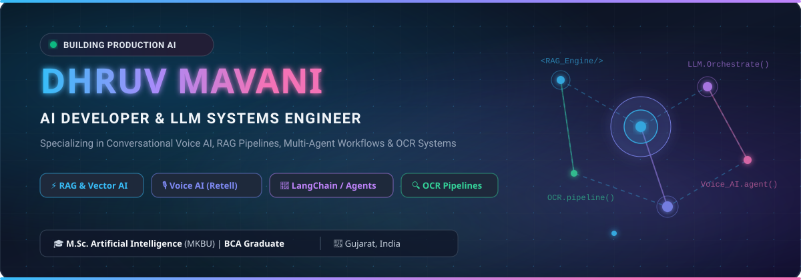
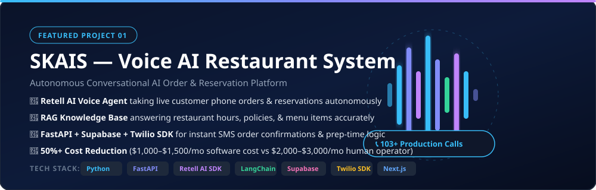
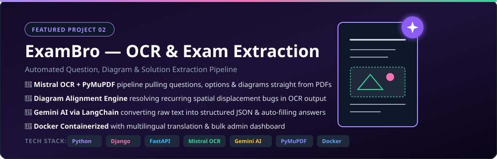
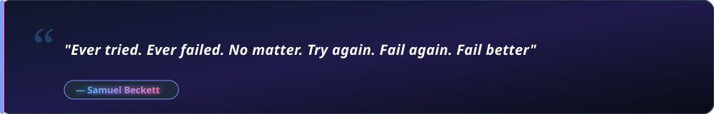

  <!-- Title Image Header Banner -->
  

    

  <!-- Quick Social & Contact Badges -->
  
  
  
  
  

    

## ⚡ Professional Overview

<table width="100%">
  <tr>
    <td width="50%" valign="top">
      <h3>👨‍💻 About Me</h3>
      
I am a dedicated <b>AI Developer</b> with <b>7 months of professional experience</b> engineering production-grade AI applications. Currently pursuing an <b>M.Sc. in Artificial Intelligence</b> (following my BCA degree), I specialize in architecting end-to-end <b>LLM applications, RAG pipelines, Conversational Voice AI agents</b>, and <b>OCR document extraction engines</b>.

      
My work centers around solving high-impact business problems—from reducing operational costs for enterprises to automating complex document workflows.

    </td>
    <td width="50%" valign="top">
      <h3>🎯 Core Focus & Credentials</h3>
      <ul>
        <li>💼 <b>AI Developer</b> at <i>Cloudus Infotech</i> (7 Months Professional Experience)</li>
        <li>🎓 <b>M.Sc. in Artificial Intelligence</b> (2025 – Present)</li>
        <li>🎓 <b>Bachelor of Computer Applications (BCA)</b> (2022 – 2025)</li>
        <li>🎙️ <b>Voice AI & RAG</b>: Real-time telephone agents with Retell AI & Twilio</li>
        <li>📄 <b>OCR & Vision</b>: Automated PDF question/diagram extraction</li>
        <li>☁️ <b>Cloud & Deployment</b>: Docker, AWS, FastAPI, Django, Supabase</li>
      </ul>
    </td>
  </tr>
</table>

 

## 🛠️ Technical Arsenal & Core Skills

### 🤖 AI, LLMs & Agents

### ⚡ RAG, Vector Search & Vision

### 💻 Backend, Databases & DevOps

### 🧰 Developer Tools & AI Engineering

 

## 🚀 Key Production Projects

### 1️⃣ SKAIS — AI-Powered Restaurant Order Management System

  

 

> **Problem**: Restaurants relied heavily on staff to answer phone calls for orders and reservations, leading to missed calls during peak hours and high recurring staffing costs.

- 🎙️ **Conversational Voice AI Agent**: Built a voice AI agent using the **Retell AI SDK** that directly answers phone calls, takes full customer orders or reservations, shares menu items, prices, and live availability without human staff picking up.
- 🧠 **RAG Knowledge Base Integration**: Connected the agent to a custom RAG knowledge base storing restaurant-specific details (hours, locations, policies) for accurate responses.
- ⚡ **Automated Workflow & SMS**: Engineered the backend using **FastAPI** and **Supabase** to record call transcripts and integrated **Twilio SDK** to dispatch instant automated SMS order and reservation confirmations.
- 💰 **Proven ROI & Impact**: Handled **103+ live calls in production** at ~$1,000–$1,500/month software cost versus $2,000–$3,000/month for a human operator. Built a dedicated SaaS owner dashboard and LangChain companion support chatbot.

**Tech Stack**: `Python` • `FastAPI` • `Retell AI SDK` • `LangChain` • `Supabase` • `Gemini AI` • `Twilio SDK` • `Next.js` • `Square POS`

---

### 2️⃣ ExamBro — Question Extraction & Exam Management System

  

 

> **Problem**: Teachers spent hours manually typing exam questions, options, answers, and copying complex diagrams into student portals—a slow and error-prone process.

- 📄 **Automated OCR Extraction**: Developed an end-to-end OCR pipeline (**Mistral OCR** + **PyMuPDF**) that extracts questions, solutions, options, and diagrams straight out of uploaded PDFs.
- 🎯 **Diagram Alignment Fix**: Resolved a critical recurring spatial bug where diagram positions shifted out of alignment with their respective questions during parsing.
- 🤖 **Structured Data Generation**: Utilized **Gemini AI via LangChain** to transform unstructured OCR text into valid structured JSON schemas and auto-fill missing answers.
- 🐳 **Enterprise Containerization**: Deployed the full solution inside **Docker** containers with multilingual translation capabilities and an intuitive admin portal for bulk question management.

**Tech Stack**: `Python` • `Django` • `FastAPI` • `Mistral OCR` • `PyMuPDF` • `OpenCV` • `Gemini AI` • `LangChain` • `Supabase` • `Docker`

 

## 💼 Professional Experience

### **AI Developer** — *Cloudus Infotech*
*Surat, Gujarat, India | Dec 2025 – Jun 2026 (7 Months)*

- 🎙️ **Voice AI Systems**: Developed and deployed customer-facing Voice AI phone agents (Retell AI SDK) for restaurant ordering & reservation platforms, managing live telephone calls in production.
- 🛡️ **Hallucination Reduction**: Diagnosed and eliminated mid-call agent hallucinations by refactoring prompt architectures, tightening guardrails, and fine-tuning response validation logic.
- 📚 **Enterprise RAG Architectures**: Designed and connected RAG knowledge bases to AI agents for accurate document-grounded context retrieval.
- 👁️ **Document OCR & Vision**: Built high-precision PDF parsing engines combining Mistral OCR, PyMuPDF, and Gemini AI for automated question and diagram extraction.
- ☁️ **AWS & Docker Infrastructure**: Dockerized production microservices and deployed full backend stacks to AWS, managing environment configs, security, and CI/CD pipelines.

 

## 🎓 Education

| Degree | Specialization | Institution | Duration |
| :--- | :--- | :--- | :--- |
| **M.Sc.** | **Artificial Intelligence** | Maharaja Krishnakumarsinhji Bhavnagar University (MKBU) | **2025 – Present** |
| **BCA** | **Bachelor of Computer Applications** | Maharaja Krishnakumarsinhji Bhavnagar University (MKBU) | **2022 – 2025** |

 

## 📫 Connect With Me

  
I am always excited to connect with fellow AI engineers, tech leaders, and collaborators!

  
  
  

 

---

  

 

Samuel Beckett: "Ever tried. Ever failed. No matter. Try again. Fail again. Fail better"
