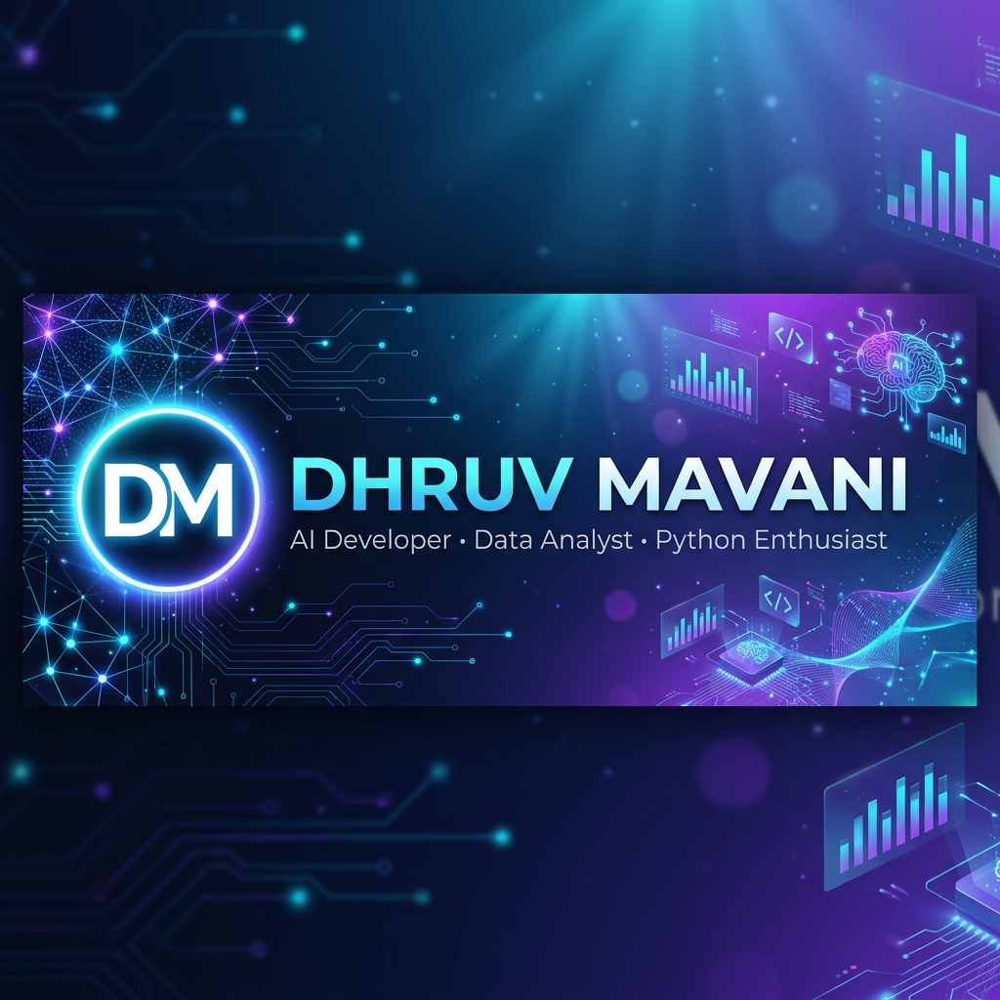
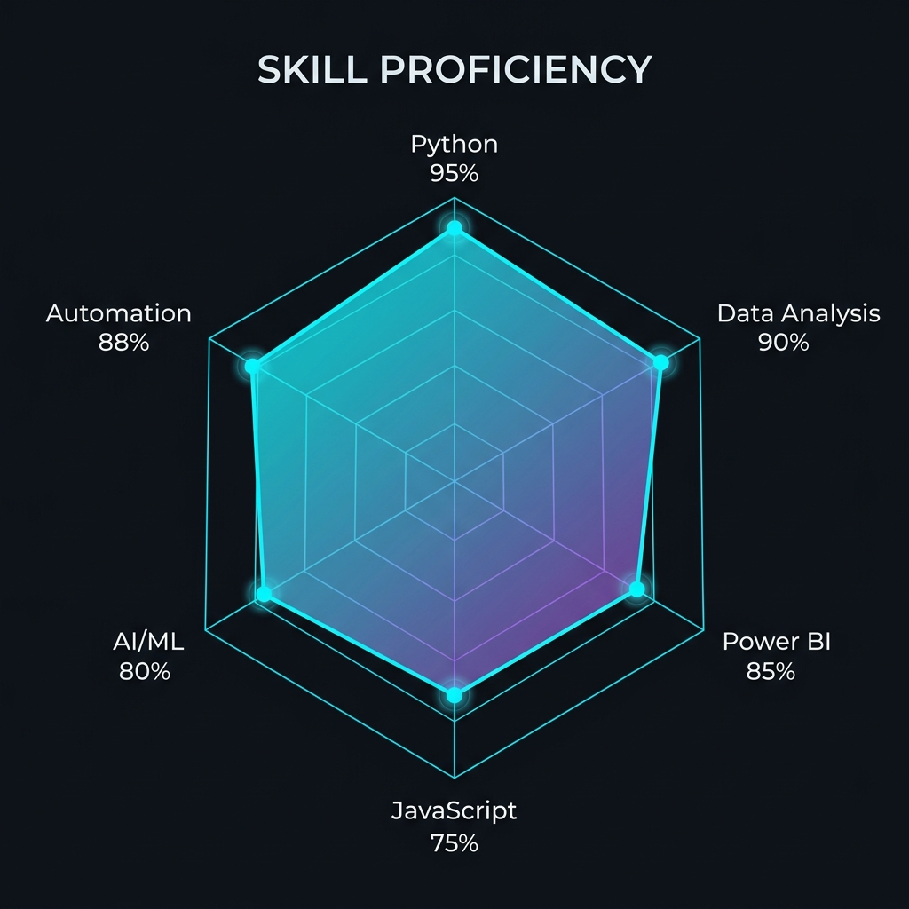
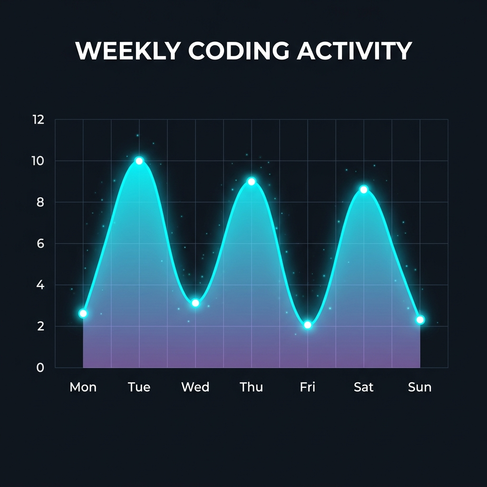
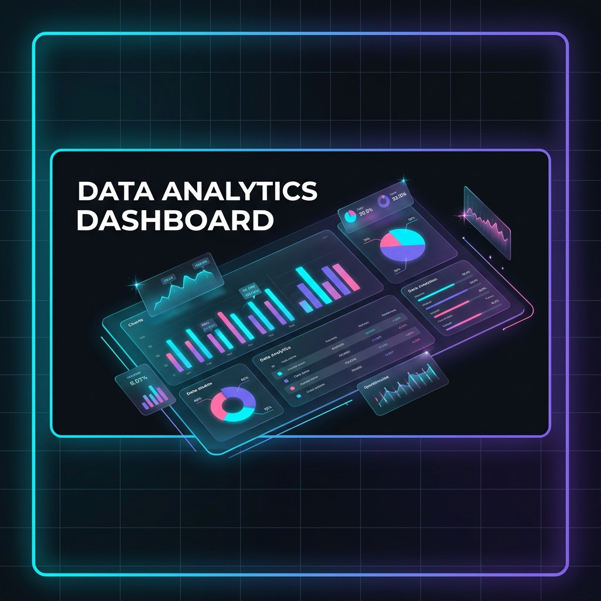

<!-- ╔══════════════════════════════════════════════════════════════════╗ -->
<!-- ║              🚀 DHRUV MAVANI — GitHub Profile README             ║ -->
<!-- ║         AI Developer • Data Analyst • Python Enthusiast          ║ -->
<!-- ╚══════════════════════════════════════════════════════════════════╝ -->

<div align="center">

<!-- ═══════════════════ ANIMATED WAVING HEADER ═══════════════════ -->


<!-- ═══════════════════ CUSTOM HERO BANNER ═══════════════════ -->
<br/>

<br/><br/>

<!-- ═══════════════════ ANIMATED TYPING SVG ═══════════════════ -->
<a href="https://git.io/typing-svg">
  
</a>

<br/><br/>

<!-- ═══════════════════ PROFILE BADGES ROW ═══════════════════ -->
<a href="https://github.com/MavaniDhruv9998">
  
</a>
&nbsp;
<a href="https://github.com/MavaniDhruv9998?tab=followers">
  
</a>
&nbsp;
<a href="https://github.com/MavaniDhruv9998?tab=repositories">
  
</a>
&nbsp;
<a href="https://github.com/MavaniDhruv9998?tab=stars">
  
</a>

</div>

<!-- ═══════════════════ RAINBOW DIVIDER ═══════════════════ -->


<!-- ╔══════════════════════════════════════════════════════════════════╗ -->
<!-- ║                        👨‍💻 ABOUT ME                              ║ -->
<!-- ╚══════════════════════════════════════════════════════════════════╝ -->

##  &nbsp;About Me


```yaml
name: Dhruv Mavani
located_in: Bhavnagar, Gujarat, India
role: AI Developer & Data Analyst

current_focus:
  - 🤖 Building AI-Powered Applications
  - 📊 Data Analytics & Visualization
  - 🐍 Python Automation & Scripting
  - 🧠 Machine Learning & Deep Learning

experience:
  - 📈 Power BI Dashboard Development
  - 🤖 WhatsApp & Chat Bot Development
  - 📧 Email Automation Systems
  - 🎓 Student Management Systems
  - 🚕 Taxi Data Analysis & Insights

fun_facts:
  - 💡 I automate everything I do twice
  - 🔥 Data is the new oil — I refine it
  - 🎯 Clean code is my love language
  - ☕ Fueled by coffee & curiosity
```

<br clear="both"/>

<!-- ═══════════════════ RAINBOW DIVIDER ═══════════════════ -->


<!-- ╔══════════════════════════════════════════════════════════════════╗ -->
<!-- ║                     🛠️ TECH STACK & SKILLS                       ║ -->
<!-- ╚══════════════════════════════════════════════════════════════════╝ -->

##  &nbsp;Tech Stack & Skills

<div align="center">

<!-- LANGUAGES -->
<h3>💻 Languages</h3>
<p>
  <a href="#"></a>
  <a href="#"></a>
  <a href="#"></a>
  <a href="#"></a>
  <a href="#"></a>
</p>

<!-- AI & DATA SCIENCE -->
<h3>🤖 AI & Data Science</h3>
<p>
  <a href="#"></a>
  <a href="#"></a>
  <a href="#"></a>
  <a href="#"></a>
  <a href="#"></a>
  <a href="#"></a>
</p>

<!-- FRAMEWORKS & TOOLS -->
<h3>🔧 Frameworks & Tools</h3>
<p>
  <a href="#"></a>
  <a href="#"></a>
  <a href="#"></a>
  <a href="#"></a>
  <a href="#"></a>
</p>

<!-- DATABASES & CLOUD -->
<h3>☁️ Databases & Cloud</h3>
<p>
  <a href="#"></a>
  <a href="#"></a>
  <a href="#"></a>
  <a href="#"></a>
  <a href="#"></a>
  <a href="#"></a>
</p>

<!-- SKILL PROFICIENCY CHART -->
<br/>


</div>

<!-- ═══════════════════ RAINBOW DIVIDER ═══════════════════ -->


<!-- ╔══════════════════════════════════════════════════════════════════╗ -->
<!-- ║                    📊 GITHUB ANALYTICS                           ║ -->
<!-- ╚══════════════════════════════════════════════════════════════════╝ -->

##  &nbsp;GitHub Analytics

<div align="center">

<!-- STATS CARDS ROW -->
<a href="https://github.com/MavaniDhruv9998">
  
</a>
&nbsp;
<a href="https://github.com/MavaniDhruv9998">
  
</a>

<br/><br/>

<!-- STREAK STATS -->
<a href="https://github.com/MavaniDhruv9998">
  
</a>

<br/><br/>

<!-- ACTIVITY GRAPH -->
<a href="https://github.com/MavaniDhruv9998">
  
</a>

<br/><br/>

<!-- CODING ACTIVITY CUSTOM CHART -->


</div>

<!-- ═══════════════════ RAINBOW DIVIDER ═══════════════════ -->


<!-- ╔══════════════════════════════════════════════════════════════════╗ -->
<!-- ║                    🏆 FEATURED PROJECTS                          ║ -->
<!-- ╚══════════════════════════════════════════════════════════════════╝ -->

##  &nbsp;Featured Projects

<div align="center">

<!-- PROJECT SHOWCASE BANNER - DATA ANALYTICS -->


<br/><br/>

<!-- PROJECT CARDS - ROW 1: DATA ANALYTICS -->
<a href="https://github.com/MavaniDhruv9998/Product-Sales-Dashboard">
  
</a>
&nbsp;
<a href="https://github.com/MavaniDhruv9998/Mobile_Sales-Dashboard">
  
</a>

<br/><br/>

<a href="https://github.com/MavaniDhruv9998/Texidata_Analysis">
  
</a>
&nbsp;
<a href="https://github.com/MavaniDhruv9998/student-management-system-">
  
</a>

<br/><br/>

<!-- PROJECT SHOWCASE BANNER - AUTOMATION -->


<br/><br/>

<!-- PROJECT CARDS - ROW 2: AUTOMATION -->
<a href="https://github.com/MavaniDhruv9998/WhatsApp-chat-bot">
  
</a>
&nbsp;
<a href="https://github.com/MavaniDhruv9998/Bulk-mail-Sender">
  
</a>

</div>

<!-- ═══════════════════ RAINBOW DIVIDER ═══════════════════ -->


<!-- ╔══════════════════════════════════════════════════════════════════╗ -->
<!-- ║                    🏅 GITHUB TROPHIES                            ║ -->
<!-- ╚══════════════════════════════════════════════════════════════════╝ -->

##  &nbsp;GitHub Trophies

<div align="center">
  <a href="https://github.com/MavaniDhruv9998">
    
  </a>
</div>

<!-- ═══════════════════ RAINBOW DIVIDER ═══════════════════ -->


<!-- ╔══════════════════════════════════════════════════════════════════╗ -->
<!-- ║                  📈 CONTRIBUTION METRICS                         ║ -->
<!-- ╚══════════════════════════════════════════════════════════════════╝ -->

##  &nbsp;Contribution Metrics

<div align="center">

<table>
<tr>
<td width="50%">

<h3 align="center">⚡ Coding Stats</h3>

| Metric | Value |
|:---|:---|
| 🔥 Total Repos | **8** |
| ⭐ Stars Earned | **3** |
| 🐍 Primary Language | **Python** |
| 📊 Analytics Dashboards | **3** |
| 🤖 Automation Bots | **2** |
| 🎓 Full-Stack Apps | **1** |
| 📍 Location | **Bhavnagar, India** |

</td>
<td width="50%">

<h3 align="center">🎯 Focus Areas</h3>

| Area | Proficiency |
|:---|:---|
| 🐍 Python Development | `████████████████████` 95% |
| 📊 Data Analytics | `███████████████████░` 90% |
| 📈 Power BI | `█████████████████░░░` 85% |
| 🤖 AI / Machine Learning | `████████████████░░░░` 80% |
| ⚙️ Automation | `██████████████████░░` 88% |
| 🌐 JavaScript | `███████████████░░░░░` 75% |

</td>
</tr>
</table>

</div>

<!-- ═══════════════════ RAINBOW DIVIDER ═══════════════════ -->


<!-- ╔══════════════════════════════════════════════════════════════════╗ -->
<!-- ║                    🐍 CONTRIBUTION SNAKE                         ║ -->
<!-- ╚══════════════════════════════════════════════════════════════════╝ -->

##  &nbsp;Contribution Snake

<div align="center">
  <picture>
    <source media="(prefers-color-scheme: dark)" srcset="https://raw.githubusercontent.com/MavaniDhruv9998/MavaniDhruv9998/output/github-snake-dark.svg" />
    <source media="(prefers-color-scheme: light)" srcset="https://raw.githubusercontent.com/MavaniDhruv9998/MavaniDhruv9998/output/github-snake.svg" />
    
  </picture>
</div>

<!-- ═══════════════════ RAINBOW DIVIDER ═══════════════════ -->


<!-- ╔══════════════════════════════════════════════════════════════════╗ -->
<!-- ║                    💬 DEV QUOTE                                  ║ -->
<!-- ╚══════════════════════════════════════════════════════════════════╝ -->

##  &nbsp;Dev Quote of the Day

<div align="center">
  <a href="https://github.com/piyushsuthar/github-readme-quotes">
    
  </a>
</div>

<!-- ═══════════════════ RAINBOW DIVIDER ═══════════════════ -->


<!-- ╔══════════════════════════════════════════════════════════════════╗ -->
<!-- ║                    🤝 CONNECT WITH ME                            ║ -->
<!-- ╚══════════════════════════════════════════════════════════════════╝ -->

##  &nbsp;Connect With Me

<div align="center">

<br/>

<a href="https://www.linkedin.com/in/dhruv-mavani-b186b6283/" target="_blank">
  
</a>
&nbsp;&nbsp;
<a href="mailto:dhruvmavani58@gmail.com" target="_blank">
  
</a>
&nbsp;&nbsp;
<a href="https://github.com/MavaniDhruv9998" target="_blank">
  
</a>
&nbsp;&nbsp;
<a href="tel:+919265861911" target="_blank">
  
</a>

<br/><br/>

<!-- SUPPORT / SPONSOR -->
<a href="https://github.com/MavaniDhruv9998">
  
</a>

<br/><br/>

<!-- INSPIRATIONAL CLOSING -->


<br/><br/>

<!-- VISITOR COUNTER WAVE -->


</div>

<!-- ═══════════════════════════════════════════════════════════════════ -->
<!-- 💖 Made with passion by Dhruv Mavani | Powered by GitHub Actions   -->
<!-- ═══════════════════════════════════════════════════════════════════ -->
