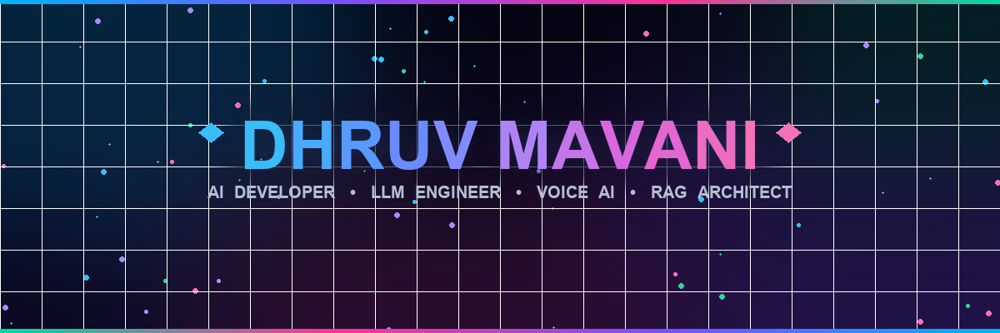
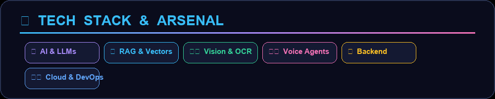
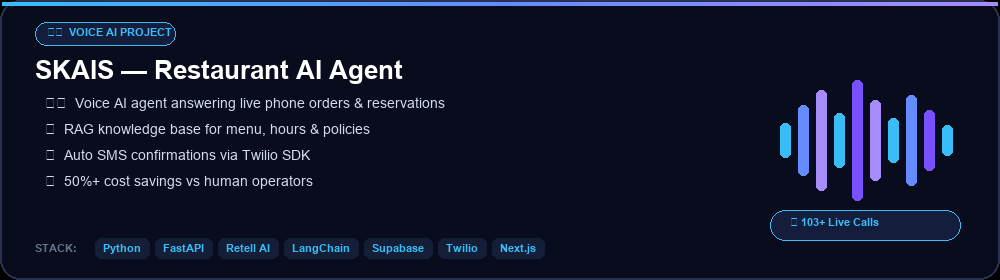
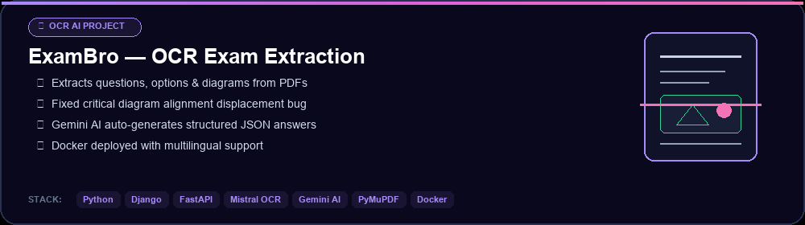
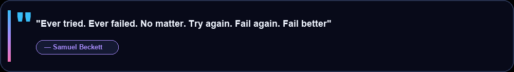

  

  
  
  
  

## 👨‍💻 About

- 🚀 **AI Developer** with **7 months production experience** at *Cloudus Infotech*
- 🎓 **M.Sc. Artificial Intelligence** (MKBU) — BCA Graduate
- 🎙️ Building **Voice AI Agents**, **RAG Pipelines** & **OCR Engines**
- 📍 Gujarat, India

## ⚡ Tech Stack

  

  
  
  
  
  
  
  
  
  
  
  
  
  
  
  
  
  
  
  
  

## 🚀 Featured Projects

  

 

  

## 💼 Experience

> **AI Developer** — *Cloudus Infotech, Surat* (Dec 2025 – Jun 2026)

- 🎙️ Deployed **Voice AI phone agents** handling live production calls
- 🛡️ Eliminated **LLM hallucinations** via prompt refactoring & guardrails
- 📚 Architected **enterprise RAG** knowledge bases for AI agents
- 👁️ Built **high-precision OCR** engines (Mistral OCR + Gemini AI)
- ☁️ **Dockerized** & deployed microservices to **AWS**

## 🎓 Education

- 🎓 **M.Sc. Artificial Intelligence** — MKBU (2025 – Present)
- 📘 **BCA** — MKBU (2022 – 2025)

## 📫 Connect

  

  
  
  

---

  

<i>Samuel Beckett: "Ever tried. Ever failed. No matter. Try again. Fail again. Fail better"</i>

